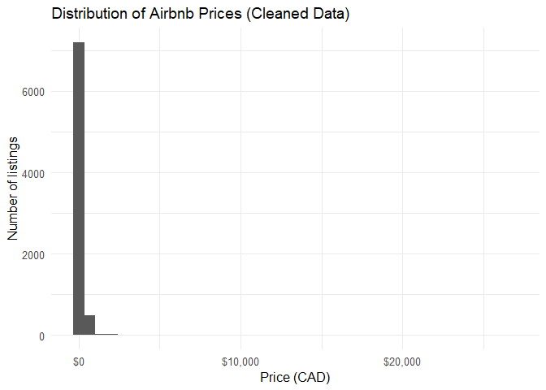
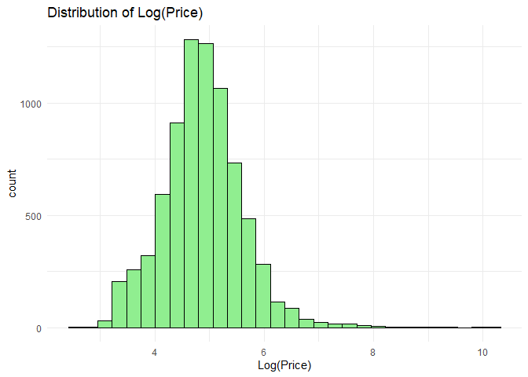
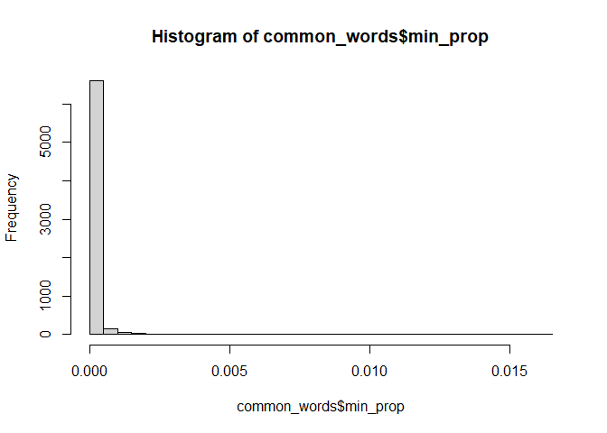

Factors on Airbnb Pricing in Montreal
================
Priestly

### RESEARCH QUESTION:

How do listing characteristics such as capacity, room type, and minimum
night requirements influence Airbnb pricing in Montreal, and does the
effect of bedrooms vary across different room types?

``` r
library(readr)
library(tidyverse)
library(dplyr)


Listings <- read_csv("listings.csv",
                 show_col_types = FALSE)

glimpse(Listings)
```

    ## Rows: 9,550
    ## Columns: 79
    ## $ id                                           <dbl> 29059, 29061, 38118, 5047…
    ## $ listing_url                                  <chr> "https://www.airbnb.com/r…
    ## $ scrape_id                                    <dbl> 2.025092e+13, 2.025092e+1…
    ## $ last_scraped                                 <date> 2025-09-18, 2025-09-18, …
    ## $ source                                       <chr> "city scrape", "city scra…
    ## $ name                                         <chr> "Lovely studio Quartier L…
    ## $ description                                  <chr> "CITQ 267153<br />Lovely …
    ## $ neighborhood_overview                        <chr> "CENTRAL is the watchword…
    ## $ picture_url                                  <chr> "https://a0.muscache.com/…
    ## $ host_id                                      <dbl> 125031, 125031, 163569, 2…
    ## $ host_url                                     <chr> "https://www.airbnb.com/u…
    ## $ host_name                                    <chr> "Maryline", "Maryline", "…
    ## $ host_since                                   <date> 2010-05-14, 2010-05-14, …
    ## $ host_location                                <chr> "Montreal, Canada", "Mont…
    ## $ host_about                                   <chr> "Voyageuse dans l'âme j'a…
    ## $ host_response_time                           <chr> "within an hour", "within…
    ## $ host_response_rate                           <chr> "100%", "100%", "0%", "10…
    ## $ host_acceptance_rate                         <chr> "100%", "100%", "0%", "10…
    ## $ host_is_superhost                            <lgl> TRUE, TRUE, FALSE, TRUE, …
    ## $ host_thumbnail_url                           <chr> "https://a0.muscache.com/…
    ## $ host_picture_url                             <chr> "https://a0.muscache.com/…
    ## $ host_neighbourhood                           <chr> "Downtown Montreal", "Dow…
    ## $ host_listings_count                          <dbl> 2, 2, 3, 2, 4, 2, 3, 1, 7…
    ## $ host_total_listings_count                    <dbl> 2, 2, 3, 3, 126, 4, 8, 1,…
    ## $ host_verifications                           <chr> "['email', 'phone', 'work…
    ## $ host_has_profile_pic                         <lgl> TRUE, TRUE, TRUE, TRUE, T…
    ## $ host_identity_verified                       <lgl> TRUE, TRUE, TRUE, TRUE, T…
    ## $ neighbourhood                                <chr> "Neighborhood highlights"…
    ## $ neighbourhood_cleansed                       <chr> "Ville-Marie", "Ville-Mar…
    ## $ neighbourhood_group_cleansed                 <lgl> NA, NA, NA, NA, NA, NA, N…
    ## $ latitude                                     <dbl> 45.51939, 45.51929, 45.52…
    ## $ longitude                                    <dbl> -73.56482, -73.56493, -73…
    ## $ property_type                                <chr> "Entire rental unit", "En…
    ## $ room_type                                    <chr> "Entire home/apt", "Entir…
    ## $ accommodates                                 <dbl> 4, 4, 1, 3, 4, 2, 4, 6, 3…
    ## $ bathrooms                                    <dbl> 1.0, 1.0, 1.0, 1.0, 1.0, …
    ## $ bathrooms_text                               <chr> "1 bath", "1 bath", "1 sh…
    ## $ bedrooms                                     <dbl> 1, 2, 3, 2, 1, 1, 1, 3, 1…
    ## $ beds                                         <dbl> 3, 2, 4, 4, 1, 1, 2, 3, N…
    ## $ amenities                                    <chr> "[\"TV with standard cabl…
    ## $ price                                        <chr> "$134.00", "$253.00", "$4…
    ## $ minimum_nights                               <dbl> 31, 2, 31, 3, 31, 32, 31,…
    ## $ maximum_nights                               <dbl> 60, 21, 60, 28, 90, 365, …
    ## $ minimum_minimum_nights                       <dbl> 1, 1, 31, 2, 1, 32, 31, 3…
    ## $ maximum_minimum_nights                       <dbl> 2, 2, 31, 3, 31, 32, 31, …
    ## $ minimum_maximum_nights                       <dbl> 1125, 21, 60, 1125, 1125,…
    ## $ maximum_maximum_nights                       <dbl> 1125, 21, 60, 1125, 1125,…
    ## $ minimum_nights_avg_ntm                       <dbl> 2.0, 2.0, 31.0, 3.0, 5.7,…
    ## $ maximum_nights_avg_ntm                       <dbl> 1125, 21, 60, 1125, 1125,…
    ## $ calendar_updated                             <lgl> NA, NA, NA, NA, NA, NA, N…
    ## $ has_availability                             <lgl> TRUE, TRUE, TRUE, TRUE, T…
    ## $ availability_30                              <dbl> 7, 6, 18, 3, 0, 0, 0, 0, …
    ## $ availability_60                              <dbl> 21, 31, 37, 7, 0, 13, 0, …
    ## $ availability_90                              <dbl> 48, 61, 47, 29, 19, 43, 0…
    ## $ availability_365                             <dbl> 312, 332, 322, 29, 38, 31…
    ## $ calendar_last_scraped                        <date> 2025-09-18, 2025-09-18, …
    ## $ number_of_reviews                            <dbl> 499, 168, 17, 349, 588, 4…
    ## $ number_of_reviews_ltm                        <dbl> 31, 20, 0, 56, 84, 4, 0, …
    ## $ number_of_reviews_l30d                       <dbl> 2, 2, 0, 5, 5, 1, 0, 2, 0…
    ## $ availability_eoy                             <dbl> 61, 76, 62, 29, 34, 58, 1…
    ## $ number_of_reviews_ly                         <dbl> 33, 24, 1, 63, 82, 5, 0, …
    ## $ estimated_occupancy_l365d                    <dbl> 255, 120, 0, 255, 255, 25…
    ## $ estimated_revenue_l365d                      <dbl> 34170, 30360, 0, 39780, 3…
    ## $ first_review                                 <date> 2010-06-20, 2012-02-23, …
    ## $ last_review                                  <date> 2025-09-01, 2025-09-02, …
    ## $ review_scores_rating                         <dbl> 4.69, 4.77, 4.53, 4.96, 4…
    ## $ review_scores_accuracy                       <dbl> 4.79, 4.85, 4.53, 4.96, 4…
    ## $ review_scores_cleanliness                    <dbl> 4.64, 4.69, 4.24, 4.95, 4…
    ## $ review_scores_checkin                        <dbl> 4.82, 4.88, 4.82, 4.96, 4…
    ## $ review_scores_communication                  <dbl> 4.79, 4.84, 4.82, 4.99, 4…
    ## $ review_scores_location                       <dbl> 4.82, 4.87, 4.65, 4.84, 4…
    ## $ review_scores_value                          <dbl> 4.68, 4.72, 4.41, 4.92, 4…
    ## $ license                                      <chr> "Quebec - Registration nu…
    ## $ instant_bookable                             <lgl> FALSE, FALSE, FALSE, TRUE…
    ## $ calculated_host_listings_count               <dbl> 2, 2, 3, 2, 4, 2, 2, 1, 7…
    ## $ calculated_host_listings_count_entire_homes  <dbl> 2, 2, 0, 1, 4, 2, 2, 1, 7…
    ## $ calculated_host_listings_count_private_rooms <dbl> 0, 0, 3, 1, 0, 0, 0, 0, 0…
    ## $ calculated_host_listings_count_shared_rooms  <dbl> 0, 0, 0, 0, 0, 0, 0, 0, 0…
    ## $ reviews_per_month                            <dbl> 2.69, 1.02, 0.10, 1.92, 3…

``` r
dim(Listings)
```

    ## [1] 9550   79

``` r
head(Listings, 15)
```

    ## # A tibble: 15 × 79
    ##        id listing_url            scrape_id last_scraped source name  description
    ##     <dbl> <chr>                      <dbl> <date>       <chr>  <chr> <chr>      
    ##  1  29059 https://www.airbnb.co…   2.03e13 2025-09-18   city … Love… CITQ 26715…
    ##  2  29061 https://www.airbnb.co…   2.03e13 2025-09-18   city … Mais… Lovely his…
    ##  3  38118 https://www.airbnb.co…   2.03e13 2025-09-18   city … Beau… Nearest me…
    ##  4  50479 https://www.airbnb.co…   2.03e13 2025-09-18   city … L'Ar… The appart…
    ##  5  66247 https://www.airbnb.co…   2.03e13 2025-09-18   city … Mode… Located in…
    ##  6  66276 https://www.airbnb.co…   2.03e13 2025-09-18   city … Urba… Escape the…
    ##  7  70489 https://www.airbnb.co…   2.03e13 2025-09-18   city … Ultr… Ultra Luxu…
    ##  8  70801 https://www.airbnb.co…   2.03e13 2025-09-18   city … Larg… Enr. CITQ:…
    ##  9  85267 https://www.airbnb.co…   2.03e13 2025-09-18   previ… Coun… <NA>       
    ## 10  99859 https://www.airbnb.co…   2.03e13 2025-09-18   city … Plat… <NA>       
    ## 11 103128 https://www.airbnb.co…   2.03e13 2025-09-18   city … Fami… <NA>       
    ## 12 135275 https://www.airbnb.co…   2.03e13 2025-09-18   city … Char… This charm…
    ## 13 137443 https://www.airbnb.co…   2.03e13 2025-09-18   city … Apt … Sunny, spa…
    ## 14 142722 https://www.airbnb.co…   2.03e13 2025-09-18   city … Char… <NA>       
    ## 15 160600 https://www.airbnb.co…   2.03e13 2025-09-18   city … Spac… Escape to …
    ## # ℹ 72 more variables: neighborhood_overview <chr>, picture_url <chr>,
    ## #   host_id <dbl>, host_url <chr>, host_name <chr>, host_since <date>,
    ## #   host_location <chr>, host_about <chr>, host_response_time <chr>,
    ## #   host_response_rate <chr>, host_acceptance_rate <chr>,
    ## #   host_is_superhost <lgl>, host_thumbnail_url <chr>, host_picture_url <chr>,
    ## #   host_neighbourhood <chr>, host_listings_count <dbl>,
    ## #   host_total_listings_count <dbl>, host_verifications <chr>, …

\###Data Cleaning Strategy

To prepare the Airbnb dataset for analysis, I applied a systematic
rule-based cleaning process using a checklist of common data issues.
Each listing was evaluated and tagged with specific removal reasons so
that the impact of filtering could be summarized transparently.

Cleaning checks performed The following issues were examined:

-Missing or invalid values: listings with missing, zero, or negative
prices, or missing key predictors (accommodates, bedrooms,
minimum_nights, room_type).

-Incorrect data types: prices and percentage variables were converted
from text to numeric format, and categorical variables were converted to
factors.

-Logical inconsistencies: listings with unrealistic combinations (e.g.,
0 bedrooms but large accommodation capacity) were flagged.

-Extreme outliers: the top 1% of prices were treated as outliers to
prevent a small number of luxury listings from dominating statistical
models.

Justification: These steps ensure that the final dataset contains valid,
comparable listings and improves the reliability of regression analysis
by reducing missing data problems, data-entry errors, and extreme
leverage points.

Transparency: Rather than filtering immediately, each rule creates a
“reason” flag. A summary table reports how many observations were
removed for each reason, making the cleaning process reproducible and
transparent.

``` r
library(dplyr)
library(readr)
library(stringr)

clean0 <- Listings %>%
  transmute(
    id = as.character(id),
    price_raw = price,
    price = parse_number(price),

    host_response_rate = parse_number(host_response_rate)/100,
    host_acceptance_rate = parse_number(host_acceptance_rate)/100,
    host_listings_count = as.numeric(host_listings_count),

    property_type = as.factor(property_type),
    room_type = as.factor(room_type),

    accommodates = as.numeric(accommodates),
    bathrooms = as.numeric(bathrooms),
    bedrooms = as.numeric(bedrooms),
    beds = as.numeric(beds),

    minimum_nights = as.numeric(minimum_nights),
    maximum_nights = as.numeric(maximum_nights),

    description = description
  )
```

``` r
clean1 <- clean0 %>%
  mutate(
    reason_price_missing = is.na(price) | price <= 0,
    reason_min_nights_missing = is.na(minimum_nights),
    reason_room_type_missing = is.na(room_type),
    reason_bedrooms_missing = is.na(bedrooms),
    reason_accommodates_missing = is.na(accommodates),

    #logical inconsistency:
    reason_inconsistent_capacity = !is.na(bedrooms) & !is.na(accommodates) &
      bedrooms == 0 & accommodates >= 1,
      log_price = log1p(price),
  )
```

``` r
# Summarize removal reasons
removal_summary <- clean1 %>%
  summarise(
    total_rows = n(),
    removed_price_missing = sum(reason_price_missing, na.rm=TRUE),
    removed_min_nights_missing = sum(reason_min_nights_missing, na.rm=TRUE),
    removed_room_type_missing = sum(reason_room_type_missing, na.rm=TRUE),
    removed_bedrooms_missing = sum(reason_bedrooms_missing, na.rm=TRUE),
    removed_accommodates_missing = sum(reason_accommodates_missing, na.rm=TRUE),
    removed_inconsistent_capacity = sum(reason_inconsistent_capacity, na.rm=TRUE)
  )

removal_summary
```

    ## # A tibble: 1 × 7
    ##   total_rows removed_price_missing removed_min_nights_m…¹ removed_room_type_mi…²
    ##        <int>                 <int>                  <int>                  <int>
    ## 1       9550                  1067                      0                      0
    ## # ℹ abbreviated names: ¹​removed_min_nights_missing, ²​removed_room_type_missing
    ## # ℹ 3 more variables: removed_bedrooms_missing <int>,
    ## #   removed_accommodates_missing <int>, removed_inconsistent_capacity <int>

### Produce the final cleaned dataset + show % removed

``` r
sub <- clean1 %>%
  filter(
    !reason_price_missing,
    !reason_min_nights_missing,
    !reason_room_type_missing,
    !reason_bedrooms_missing,
    !reason_accommodates_missing,
    !reason_inconsistent_capacity
  ) 

cat("Rows before:", nrow(clean1), "\n")
```

    ## Rows before: 9550

``` r
cat("Rows after :", nrow(sub), "\n")
```

    ## Rows after : 7748

``` r
cat("Percent kept:", round(100*nrow(sub)/nrow(clean1), 1), "%\n")
```

    ## Percent kept: 81.1 %

``` r
glimpse(sub)
```

    ## Rows: 7,748
    ## Columns: 22
    ## $ id                           <chr> "29059", "29061", "38118", "50479", "6624…
    ## $ price_raw                    <chr> "$134.00", "$253.00", "$47.00", "$156.00"…
    ## $ price                        <dbl> 134, 253, 47, 156, 146, 57, 90, 386, 233,…
    ## $ host_response_rate           <dbl> 1.00, 1.00, 0.00, 1.00, 0.96, 1.00, 1.00,…
    ## $ host_acceptance_rate         <dbl> 1.00, 1.00, 0.00, 1.00, 0.99, 1.00, 0.94,…
    ## $ host_listings_count          <dbl> 2, 2, 3, 2, 4, 2, 3, 1, 1, 1, 3, 1, 2, 8,…
    ## $ property_type                <fct> Entire rental unit, Entire home, Private …
    ## $ room_type                    <fct> Entire home/apt, Entire home/apt, Private…
    ## $ accommodates                 <dbl> 4, 4, 1, 3, 4, 2, 4, 6, 4, 7, 2, 5, 4, 2,…
    ## $ bathrooms                    <dbl> 1.0, 1.0, 1.0, 1.0, 1.0, 1.0, 1.5, 2.5, 1…
    ## $ bedrooms                     <dbl> 1, 2, 3, 2, 1, 1, 1, 3, 2, 4, 1, 2, 2, 1,…
    ## $ beds                         <dbl> 3, 2, 4, 4, 1, 1, 2, 3, 3, 4, 1, 2, 3, 1,…
    ## $ minimum_nights               <dbl> 31, 2, 31, 3, 31, 32, 31, 32, 31, 5, 31, …
    ## $ maximum_nights               <dbl> 60, 21, 60, 28, 90, 365, 365, 96, 364, 14…
    ## $ description                  <chr> "CITQ 267153<br />Lovely studio with 1 cl…
    ## $ reason_price_missing         <lgl> FALSE, FALSE, FALSE, FALSE, FALSE, FALSE,…
    ## $ reason_min_nights_missing    <lgl> FALSE, FALSE, FALSE, FALSE, FALSE, FALSE,…
    ## $ reason_room_type_missing     <lgl> FALSE, FALSE, FALSE, FALSE, FALSE, FALSE,…
    ## $ reason_bedrooms_missing      <lgl> FALSE, FALSE, FALSE, FALSE, FALSE, FALSE,…
    ## $ reason_accommodates_missing  <lgl> FALSE, FALSE, FALSE, FALSE, FALSE, FALSE,…
    ## $ reason_inconsistent_capacity <lgl> FALSE, FALSE, FALSE, FALSE, FALSE, FALSE,…
    ## $ log_price                    <dbl> 4.905275, 5.537334, 3.871201, 5.056246, 4…

## Exploratory Data Analysis:

## Numeric summaries

``` r
library(scales)

sub %>%
  summarise(
    price_min = min(price, na.rm=TRUE),
    price_med = median(price, na.rm=TRUE),
    price_mean = mean(price, na.rm=TRUE),
    price_max = max(price, na.rm=TRUE)
  )
```

    ## # A tibble: 1 × 4
    ##   price_min price_med price_mean price_max
    ##       <dbl>     <dbl>      <dbl>     <dbl>
    ## 1        12       129       185.     26724

### Plot Of price

``` r
library(ggplot2)

ggplot(sub, aes(price)) +
  geom_histogram(bins = 40) +
  scale_x_continuous(labels = dollar_format()) +
  labs(
    title = "Distribution of Airbnb Prices (Cleaned Data)",
    x = "Price (CAD)",
    y = "Number of listings"
  ) +
  theme_minimal(base_size = 12)
```

<!-- -->

## Visualizing Why Used Log of Price Instead of Price

``` r
library(ggplot2)

# Original price
ggplot(sub, aes(x = price)) +
  geom_histogram(fill = "skyblue", color = "black", bins = 30) +
  ggtitle("Distribution of Price") +
  xlab("Price") +
  theme_minimal()
```

<!-- -->

``` r
# Log-transformed price
ggplot(sub, aes(x = log_price)) +
  geom_histogram(fill = "lightgreen", color = "black", bins = 30) +
  ggtitle("Distribution of Log(Price)") +
  xlab("Log(Price)") +
  theme_minimal()
```

<!-- -->

``` r
library(dplyr)
library(stringr)
library(tidytext)
library(wordcloud)
library(RColorBrewer)

# 1) Build grouped text data
text_df <- sub %>%
  filter(!is.na(description), !is.na(price)) %>%
  mutate(price_group = if_else(price >= median(price, na.rm = TRUE),
                               "High price", "Low price")) %>%
  select(id, price_group, description)

# Tokenize + remove stopwords + keep sensible tokens
words <- text_df %>%
  unnest_tokens(word, description) %>%
  anti_join(stop_words, by = "word") %>%
  filter(str_detect(word, "^[a-z]+$"), nchar(word) > 2)

word_counts <- words %>%
  count(price_group, word, sort = TRUE)

top_high <- word_counts %>%
  filter(price_group == "High price") %>%
  slice_max(n, n = 50)

top_low <- word_counts %>%
  filter(price_group == "Low price") %>%
  slice_max(n, n = 50)

# Wordcloud visualization (side-by-side comparison)
par(mfrow = c(1, 2), mar = c(1, 1, 3, 1))
wordcloud(words = top_low$word, freq = top_low$n,
          max.words = 50, random.order = FALSE,
          scale = c(2.2, 0.6),
          colors = brewer.pal(8, "Dark2"))
title("Low price listings")

wordcloud(words = top_high$word, freq = top_high$n,
          max.words = 50, random.order = FALSE,
          scale = c(2.2, 0.6),
          colors = brewer.pal(8, "Dark2"))
title("High price listings")
```

<!-- -->

``` r
par(mfrow = c(1, 1))
overall_counts <- words %>%
  count(word, sort = TRUE)

# Overall wordcloud (all listings combined)
wordcloud(words = overall_counts$word, freq = overall_counts$n,
          min.freq = 20, max.words = 100,
          random.order = FALSE,
          scale = c(2.5, 0.5),
          colors = brewer.pal(8, "Dark2"))
title("Overall (all listings)")
```

<!-- -->

### Within-Group Word Proportions (Normalize for Group Size)

``` r
library(dplyr)
library(tidyr)
# Normalize word frequencies within each price group

# Count words by group
word_counts <- words %>%
  count(price_group, word)

# Total word counts per group
group_totals <- word_counts %>%
  group_by(price_group) %>%
  summarise(total = sum(n), .groups = "drop")

# Compute within-group proportions
word_props <- word_counts %>%
  left_join(group_totals, by = "price_group") %>%
  mutate(prop = n / total)

head(word_props,1000)
```

    ## # A tibble: 1,000 × 5
    ##    price_group word           n  total       prop
    ##    <chr>       <chr>      <int>  <int>      <dbl>
    ##  1 High price  aaa            6 129914 0.0000462 
    ##  2 High price  ability        1 129914 0.00000770
    ##  3 High price  abode          1 129914 0.00000770
    ##  4 High price  abounds        3 129914 0.0000231 
    ##  5 High price  absolute       4 129914 0.0000308 
    ##  6 High price  absolutely     4 129914 0.0000308 
    ##  7 High price  abundance      7 129914 0.0000539 
    ##  8 High price  abundant      18 129914 0.000139  
    ##  9 High price  acacia         1 129914 0.00000770
    ## 10 High price  academic      30 129914 0.000231  
    ## # ℹ 990 more rows

``` r
table(text_df$price_group)
```

    ## 
    ## High price  Low price 
    ##       3838       3778

``` r
table(words$price_group)
```

    ## 
    ## High price  Low price 
    ##     129914     117397

### Identifying Highly Shared (Generic) Words Across Price Groups

``` r
common_words <- word_props %>%
  select(price_group, word, prop) %>%
  pivot_wider(
    names_from = price_group,
    values_from = prop,
    values_fill = 0
  ) %>%
  mutate(min_prop = pmin(`High price`, `Low price`)) %>%
  arrange(desc(min_prop))

common_words %>%
  select(word, `High price`, `Low price`, min_prop) %>%
  slice_max(min_prop, n = 75)
```

    ## # A tibble: 75 × 4
    ##    word        `High price` `Low price` min_prop
    ##    <chr>              <dbl>       <dbl>    <dbl>
    ##  1 montreal         0.0184      0.0163   0.0163 
    ##  2 apartment        0.0160      0.0158   0.0158 
    ##  3 located          0.0135      0.0159   0.0135 
    ##  4 downtown         0.0105      0.0104   0.0104 
    ##  5 bedroom          0.0106      0.00927  0.00927
    ##  6 kitchen          0.00909     0.00896  0.00896
    ##  7 restaurants      0.00861     0.00860  0.00860
    ##  8 metro            0.00831     0.0136   0.00831
    ##  9 enjoy            0.00898     0.00809  0.00809
    ## 10 stay             0.00888     0.00744  0.00744
    ## # ℹ 65 more rows

``` r
summary(common_words$min_prop)
```

    ##      Min.   1st Qu.    Median      Mean   3rd Qu.      Max. 
    ## 0.000e+00 0.000e+00 0.000e+00 1.106e-04 2.309e-05 1.630e-02

``` r
quantile(common_words$min_prop, probs = seq(0,1,0.1))
```

    ##           0%          10%          20%          30%          40%          50% 
    ## 0.0000000000 0.0000000000 0.0000000000 0.0000000000 0.0000000000 0.0000000000 
    ##          60%          70%          80%          90%         100% 
    ## 0.0000076974 0.0000153948 0.0000384870 0.0001533259 0.0162951353

``` r
hist(common_words$min_prop, breaks = 50)
```

<!-- -->

### Creating an Airbnb-Specific Stopword List

## We removed words with min_prop ≥ 0.002, which corresponds to extremely high shared-frequency terms well above the 90th percentile.

``` r
airbnb_stop <- common_words %>%
  filter(min_prop >= 0.002) %>%
  pull(word)

# Number of words removed
length(airbnb_stop)
```

    ## [1] 78

``` r
# Inspect first few removed words
head(airbnb_stop, 80)
```

    ##  [1] "montreal"     "apartment"    "located"      "downtown"     "bedroom"     
    ##  [6] "kitchen"      "restaurants"  "metro"        "enjoy"        "stay"        
    ## [11] "bed"          "walk"         "living"       "equipped"     "home"        
    ## [16] "private"      "heart"        "perfect"      "city"         "access"      
    ## [21] "space"        "parking"      "street"       "minutes"      "spacious"    
    ## [26] "steps"        "bathroom"     "location"     "renovated"    "cozy"        
    ## [31] "comfortable"  "modern"       "station"      "shops"        "close"       
    ## [36] "ideal"        "beautiful"    "floor"        "bedrooms"     "building"    
    ## [41] "unit"         "comfort"      "royal"        "queen"        "easy"        
    ## [46] "amenities"    "minute"       "free"         "dryer"        "neighborhood"
    ## [51] "walking"      "bright"       "offers"       "washer"       "condo"       
    ## [56] "min"          "experience"   "distance"     "stylish"      "furnished"   
    ## [61] "quiet"        "plateau"      "mont"         "vibrant"      "cafes"       
    ## [66] "convenience"  "nearby"       "center"       "park"         "des"         
    ## [71] "wifi"         "family"       "guests"       "bars"         "dining"      
    ## [76] "public"       "balcony"      "pool"

``` r
airbnb_stop <- common_words %>%
  filter(min_prop >= 0.002) %>%
  arrange(desc(min_prop))

# Display removed words with their proportions in both groups
airbnb_stop %>%
  select(word, `High price`, `Low price`, min_prop)
```

    ## # A tibble: 78 × 4
    ##    word        `High price` `Low price` min_prop
    ##    <chr>              <dbl>       <dbl>    <dbl>
    ##  1 montreal         0.0184      0.0163   0.0163 
    ##  2 apartment        0.0160      0.0158   0.0158 
    ##  3 located          0.0135      0.0159   0.0135 
    ##  4 downtown         0.0105      0.0104   0.0104 
    ##  5 bedroom          0.0106      0.00927  0.00927
    ##  6 kitchen          0.00909     0.00896  0.00896
    ##  7 restaurants      0.00861     0.00860  0.00860
    ##  8 metro            0.00831     0.0136   0.00831
    ##  9 enjoy            0.00898     0.00809  0.00809
    ## 10 stay             0.00888     0.00744  0.00744
    ## # ℹ 68 more rows

``` r
#Example
word_counts %>%
  filter(word == "montreal")
```

    ## # A tibble: 2 × 3
    ##   price_group word         n
    ##   <chr>       <chr>    <int>
    ## 1 High price  montreal  2392
    ## 2 Low price   montreal  1913

``` r
airbnb_stop_words <- airbnb_stop$word

words_clean <- words %>%
  filter(!word %in% airbnb_stop_words)


# Compare token counts before and after filtering
cat("Rows before:", nrow(words), "\n")
```

    ## Rows before: 247311

``` r
cat("Rows after :", nrow(words_clean), "\n")
```

    ## Rows after : 146190

### Constructing TF–IDF Text Features

``` r
# Compute TF–IDF for each listing
dtm_tfidf <- words_clean %>%
  count(id, word) %>%
  bind_tf_idf(word, id, n)

# Inspect first few TF–IDF entries
head(dtm_tfidf,1000)
```

    ## # A tibble: 1,000 × 6
    ##    id                 word             n     tf   idf tf_idf
    ##    <chr>              <chr>        <int>  <dbl> <dbl>  <dbl>
    ##  1 1.005025077628e+18 air              1 0.0323  2.89 0.0932
    ##  2 1.005025077628e+18 bath             1 0.0323  3.49 0.113 
    ##  3 1.005025077628e+18 bathtub          1 0.0323  4.32 0.139 
    ##  4 1.005025077628e+18 bedding          1 0.0323  3.73 0.120 
    ##  5 1.005025077628e+18 central          1 0.0323  3.12 0.101 
    ##  6 1.005025077628e+18 channels         1 0.0323  5.22 0.168 
    ##  7 1.005025077628e+18 coffee           1 0.0323  2.78 0.0897
    ##  8 1.005025077628e+18 complete         1 0.0323  4.21 0.136 
    ##  9 1.005025077628e+18 conditioning     1 0.0323  3.41 0.110 
    ## 10 1.005025077628e+18 cooking          1 0.0323  4.13 0.133 
    ## # ℹ 990 more rows

### Attach Price Labels to TF–IDF Features

``` r
dtm_tfidf_grouped <- dtm_tfidf %>%
  left_join(text_df %>% select(id, price_group), by = "id")

# Inspect the merged dataset
head(dtm_tfidf_grouped,40)
```

    ## # A tibble: 40 × 7
    ##    id                 word             n     tf   idf tf_idf price_group
    ##    <chr>              <chr>        <int>  <dbl> <dbl>  <dbl> <chr>      
    ##  1 1.005025077628e+18 air              1 0.0323  2.89 0.0932 Low price  
    ##  2 1.005025077628e+18 bath             1 0.0323  3.49 0.113  Low price  
    ##  3 1.005025077628e+18 bathtub          1 0.0323  4.32 0.139  Low price  
    ##  4 1.005025077628e+18 bedding          1 0.0323  3.73 0.120  Low price  
    ##  5 1.005025077628e+18 central          1 0.0323  3.12 0.101  Low price  
    ##  6 1.005025077628e+18 channels         1 0.0323  5.22 0.168  Low price  
    ##  7 1.005025077628e+18 coffee           1 0.0323  2.78 0.0897 Low price  
    ##  8 1.005025077628e+18 complete         1 0.0323  4.21 0.136  Low price  
    ##  9 1.005025077628e+18 conditioning     1 0.0323  3.41 0.110  Low price  
    ## 10 1.005025077628e+18 cooking          1 0.0323  4.13 0.133  Low price  
    ## # ℹ 30 more rows

### Comparing Average TF–IDF by Price Group

``` r
avg_tfidf <- dtm_tfidf_grouped %>%
  group_by(price_group, word) %>%
  summarise(mean_tfidf = mean(tf_idf), .groups = "drop")

library(tidyr)

avg_compare <- avg_tfidf %>%
  pivot_wider(
    names_from = price_group,
    values_from = mean_tfidf,
    values_fill = 0
  ) %>%
  mutate(diff = `High price` - `Low price`) %>%
  filter(!is.na(diff))   # safety
head(avg_compare)
```

    ## # A tibble: 6 × 4
    ##   word       `High price` `Low price`    diff
    ##   <chr>             <dbl>       <dbl>   <dbl>
    ## 1 aaa               0.270       0.233  0.0366
    ## 2 ability           0.245       0.396 -0.151 
    ## 3 abode             0.527       0.289  0.239 
    ## 4 abounds           0.270       0      0.270 
    ## 5 absolute          0.356       0.373 -0.0170
    ## 6 absolutely        0.269       0.461 -0.192

``` r
# Top words associated with High-price listings
top_high <- avg_compare %>%
  filter(diff > 0) %>%
  arrange(desc(diff)) %>%
  head(n = 75)

# Top words associated with Low-price listings
top_low <- avg_compare %>%
  filter(diff < 0) %>%
  arrange(diff) %>%
  head(n = 75)

# "Mid" words: closest to 0 difference (most similar usage)
mid <- avg_compare %>%
  mutate(abs_diff = abs(diff)) %>%
  arrange(abs_diff) %>%
  slice_head(n = 75) %>%
  select(-abs_diff)

head(avg_compare$diff)
```

    ## [1]  0.03664783 -0.15091757  0.23874729  0.26979851 -0.01700433 -0.19191316

``` r
# View only the words
top_high$word
```

    ##  [1] "coast"         "virtue"        "bds"           "monreal"      
    ##  [5] "clarity"       "bordering"     "calmness"      "twenty"       
    ##  [9] "crossroad"     "immense"       "objectively"   "plazas"       
    ## [13] "shiny"         "consult"       "demising"      "equippeddecor"
    ## [17] "ont"           "une"           "galeria"       "attentions"   
    ## [21] "perspective"   "rebuilt"       "refund"        "smal"         
    ## [25] "colour"        "geo"           "hamstead"      "hipster"      
    ## [29] "positionned"   "loftsjc"       "appartmeent"   "ligne"        
    ## [33] "ally"          "consoles"      "critique"      "foody"        
    ## [37] "homeland"      "repeat"        "suggestions"   "wars"         
    ## [41] "improve"       "centraly"      "ultramodern"   "archaeology"  
    ## [45] "bests"         "caribou"       "chimney"       "demands"      
    ## [49] "differs"       "fluery"        "foldaway"      "fortunate"    
    ## [53] "glued"         "passers"       "piscine"       "raised"       
    ## [57] "roller"        "schubert"      "stylings"      "temple"       
    ## [61] "unfolding"     "appearance"    "coworkers"     "pinnacle"     
    ## [65] "renoved"       "lll"           "pls"           "standout"     
    ## [69] "pops"          "accomplish"    "approach"      "archical"     
    ## [73] "barefoot"      "bond"          "chapel"

``` r
# View first 20 words with their differences
top_high %>%
  select(word, diff) %>%
  head(20)
```

    ## # A tibble: 20 × 2
    ##    word           diff
    ##    <chr>         <dbl>
    ##  1 coast          4.47
    ##  2 virtue         4.47
    ##  3 bds            2.98
    ##  4 monreal        2.98
    ##  5 clarity        2.54
    ##  6 bordering      2.23
    ##  7 calmness       2.23
    ##  8 twenty         2.02
    ##  9 crossroad      1.79
    ## 10 immense        1.79
    ## 11 objectively    1.79
    ## 12 plazas         1.79
    ## 13 shiny          1.79
    ## 14 consult        1.72
    ## 15 demising       1.49
    ## 16 equippeddecor  1.49
    ## 17 ont            1.49
    ## 18 une            1.49
    ## 19 galeria        1.41
    ## 20 attentions     1.28

``` r
# View only the words
top_low$word
```

    ##  [1] "amendities"    "laurel"        "annually"      "frotenac"     
    ##  [5] "harbor"        "troubles"      "quietness"     "mns"          
    ##  [9] "astonishing"   "joys"          "bunks"         "forests"      
    ## [13] "manner"        "neibourhood"   "quietinage"    "retails"      
    ## [17] "nap"           "occupation"    "buiding"       "generational" 
    ## [21] "eats"          "mrt"           "enchanting"    "stanley"      
    ## [25] "dormitory"     "enthusiastic"  "dorm"          "covid"        
    ## [29] "bedroomes"     "branch"        "charms"        "lasal"        
    ## [33] "quests"        "seemingly"     "shihtzus"      "westminster"  
    ## [37] "surprise"      "semester"      "aged"          "wheelchair"   
    ## [41] "payable"       "brighter"      "cenetre"       "complains"    
    ## [45] "hopital"       "nighlife"      "shoppings"     "supermaket"   
    ## [49] "citadin"       "activity"      "expire"        "women"        
    ## [53] "approximate"   "deluxe"        "agrignon"      "adopted"      
    ## [57] "awater"        "convienet"     "encompassing"  "facilits"     
    ## [61] "garnier"       "lafontaines"   "lightful"      "logis"        
    ## [65] "motorway"      "nereo"         "noble"         "plateausuites"
    ## [69] "previous"      "solano"        "unt"           "vary"         
    ## [73] "mode"          "seater"        "traveling"

``` r
# View first 20 words with their differences
top_low %>%
  select(word, diff) %>%
  head(20)
```

    ## # A tibble: 20 × 2
    ##    word          diff
    ##    <chr>        <dbl>
    ##  1 amendities   -4.47
    ##  2 laurel       -4.47
    ##  3 annually     -4.12
    ##  4 frotenac     -2.98
    ##  5 harbor       -2.98
    ##  6 troubles     -2.98
    ##  7 quietness    -2.48
    ##  8 mns          -2.36
    ##  9 astonishing  -2.23
    ## 10 joys         -2.23
    ## 11 bunks        -1.99
    ## 12 forests      -1.79
    ## 13 manner       -1.79
    ## 14 neibourhood  -1.79
    ## 15 quietinage   -1.79
    ## 16 retails      -1.79
    ## 17 nap          -1.73
    ## 18 occupation   -1.62
    ## 19 buiding      -1.49
    ## 20 generational -1.49

``` r
# View only the words
mid$word
```

    ##  [1] "beating"       "bijou"         "buzzy"         "crashing"     
    ##  [5] "craves"        "drawn"         "education"     "electrifying" 
    ##  [9] "emilie"        "floral"        "foreign"       "fur"          
    ## [13] "gamelin"       "habitants"     "hill"          "hubs"         
    ## [17] "inaugural"     "incur"         "infamous"      "locking"      
    ## [21] "magnetism"     "necessarily"   "partir"        "pharmacie"    
    ## [25] "playful"       "pregaming"     "proof"         "pulsating"    
    ## [29] "quarantine"    "rapide"        "removal"       "reputation"   
    ## [33] "rosy"          "royaux"        "salads"        "scheduled"    
    ## [37] "scooter"       "strive"        "superhosts"    "temporarily"  
    ## [41] "toilette"      "uni"           "walkway"       "wanderers"    
    ## [45] "ycg"           "sparkling"     "extraordinary" "hip"          
    ## [49] "tamtam"        "bakeries"      "terrasse"      "fitness"      
    ## [53] "bedding"       "fosters"       "pursuits"      "resort"       
    ## [57] "quad"          "henri"         "bakery"        "message"      
    ## [61] "lobby"         "fleury"        "sainte"        "newcomers"    
    ## [65] "fullest"       "smart"         "concept"       "boutiques"    
    ## [69] "transform"     "freezer"       "groceries"     "loft"         
    ## [73] "services"      "remarkable"    "relaxed"

``` r
# View first 20 words with their differences
mid %>%
  select(word, diff) %>%
  head(20)
```

    ## # A tibble: 20 × 2
    ##    word          diff
    ##    <chr>        <dbl>
    ##  1 beating          0
    ##  2 bijou            0
    ##  3 buzzy            0
    ##  4 crashing         0
    ##  5 craves           0
    ##  6 drawn            0
    ##  7 education        0
    ##  8 electrifying     0
    ##  9 emilie           0
    ## 10 floral           0
    ## 11 foreign          0
    ## 12 fur              0
    ## 13 gamelin          0
    ## 14 habitants        0
    ## 15 hill             0
    ## 16 hubs             0
    ## 17 inaugural        0
    ## 18 incur            0
    ## 19 infamous         0
    ## 20 locking          0

### Wordclouds of Price-Differentiating Language (TF–IDF Differences)

``` r
library(wordcloud)
library(RColorBrewer)

par(mfrow = c(1,1),
    mar = c(2,2,3,2))

wordcloud(
  words = top_high$word,
freq = abs(top_high$diff),
min.freq = 0.5,  
  random.order = FALSE,
  scale = c(2.5, 0.7),
  colors = brewer.pal(8, "Dark2")
)
```

<!-- -->

``` r
wordcloud(
  words = top_low$word,
  freq = abs(top_low$diff),
  min.freq = 0.5,  
  max.words = 150,
  random.order = FALSE,
  scale = c(2.5, 0.8),
  colors = brewer.pal(8, "Dark2")
)
```

<!-- -->

``` r
wordcloud(
  words = mid$word,
  freq = (mid$diff),
  max.words = 75,
  random.order = FALSE,
  scale = c(2.5, 0.7),
  colors = brewer.pal(8, "Dark2")
)
```

<!-- -->

``` r
par(mfrow = c(1,1))
```

## Dimension Reduction on Listing Descriptions

### Construct Document–Term Matrix (TF–IDF Weighted)

``` r
library(tidyr)
dtm_matrix <- dtm_tfidf %>% 
  select(id, word, tf_idf) %>% 
  pivot_wider( names_from = word, values_from = tf_idf, values_fill = 0 
               ) 

# Inspect matrix dimensions (listings × vocabulary size)
dim(dtm_matrix)
```

    ## [1] 7604 6834

### Prepare Numeric Matrix for PCA

``` r
dtm_numeric <- dtm_matrix %>%
  select(-id)

#confirm columns are numeric
is.numeric(dtm_numeric[[1]])
```

    ## [1] TRUE

### Principal Component Analysis (Truncated SVD via irlba)

``` r
# fast PCA for large matrices
if (!requireNamespace("irlba", quietly = TRUE)) install.packages("irlba")
library(irlba)

pca_model <- prcomp_irlba(as.matrix(dtm_numeric),
                          n = 10,      # number of PCs
                          center = TRUE,
                          scale. = TRUE)

# Examine proportion of variance explained
summary(pca_model)
```

    ## Importance of components:
    ##                           PC1     PC2     PC3     PC4     PC5     PC6     PC7
    ## Standard deviation     4.2951 4.07033 4.06149 3.90451 3.51963 3.51276 3.49902
    ## Proportion of Variance 0.0027 0.00242 0.00241 0.00223 0.00181 0.00181 0.00179
    ## Cumulative Proportion  0.0027 0.00512 0.00754 0.00977 0.01158 0.01339 0.01518
    ##                            PC8     PC9    PC10
    ## Standard deviation     3.48203 3.43497 3.42304
    ## Proportion of Variance 0.00177 0.00173 0.00171
    ## Cumulative Proportion  0.01695 0.01868 0.02040

### Variance Explained by Principal Components

``` r
imp <- summary(pca_model)$importance

# Display first 10 principal components
imp[, 1:10]
```

    ##                            PC1      PC2      PC3      PC4     PC5      PC6
    ## Standard deviation     4.29508 4.070334 4.061488 3.904514 3.51963 3.512761
    ## Proportion of Variance 0.00270 0.002420 0.002410 0.002230 0.00181 0.001810
    ## Cumulative Proportion  0.00270 0.005120 0.007540 0.009770 0.01158 0.013390
    ##                             PC7      PC8      PC9     PC10
    ## Standard deviation     3.499016 3.482025 3.434972 3.423044
    ## Proportion of Variance 0.001790 0.001770 0.001730 0.001710
    ## Cumulative Proportion  0.015180 0.016950 0.018680 0.020400

### Attach PCA Scores to Price Groups

``` r
# 1) Build DTM (includes id column)
dtm_matrix <- dtm_tfidf %>% 
  select(id, word, tf_idf) %>% 
  tidyr::pivot_wider(names_from = word, values_from = tf_idf, values_fill = 0)

# 2) Make numeric matrix X with rownames = id
X <- dtm_matrix %>%
  mutate(id = as.character(id)) %>%
  tibble::column_to_rownames("id") %>%
  as.matrix()

# 3) Drop rows that are all zeros (no remaining words)
keep <- rowSums(X) != 0
X_use <- X[keep, , drop = FALSE]


library(irlba)
pca_model <- prcomp_irlba(X_use, n = 10, center = TRUE, scale. = TRUE)

# 5) Scores + correct ids
scores <- as.data.frame(pca_model$x)
scores$id <- rownames(X_use)

# 6) Attach price group
price_lookup <- text_df %>%
  distinct(id, price_group) %>%
  mutate(id = as.character(id))

scores <- scores %>%
  left_join(price_lookup, by = "id")

# sanity checks
nrow(scores)
```

    ## [1] 7604

``` r
table(scores$price_group, useNA = "ifany")
```

    ## 
    ## High price  Low price 
    ##       3835       3769

### Do PCA Language Components Differ by Price Group? (t-tests)

``` r
# the ids used in PCA, in the same row order
ids_used <- dtm_matrix$id

scores <- as.data.frame(pca_model$x)
scores$id <- ids_used

# Attach price group labels
scores <- scores %>%
  mutate(id = as.character(id)) %>%
  left_join(price_lookup %>% mutate(id = as.character(id)), by = "id")
table(scores$price_group, useNA = "ifany")
```

    ## 
    ## High price  Low price 
    ##       3835       3769

``` r
head(scores$id)
```

    ## [1] "1.005025077628e+18" "1.045168257227e+18" "1.082751630868e+18"
    ## [4] "1.094857809513e+18" "1.101609371426e+18" "1.10488477035e+18"

``` r
head(price_lookup$id)
```

    ## [1] "29059" "29061" "38118" "50479" "66247" "66276"

### Interpreting PC2 via Word Loadings

``` r
loadings <- pca_model$rotation[,2]

# Top positive words (largest contributors to positive PC2 direction)
sort(loadings, decreasing = TRUE)[1:15]
```

    ##  [1] 0.01837831 0.01837831 0.01837831 0.01837831 0.01837831 0.01837831
    ##  [7] 0.01837831 0.01837831 0.01837831 0.01837831 0.01837831 0.01837831
    ## [13] 0.01837831 0.01837831 0.01837831

``` r
# Top negative words (largest contributors to negative PC2 direction)
sort(loadings)[1:15]
```

    ##  [1] -0.2331790 -0.2331790 -0.2331790 -0.2331790 -0.2278868 -0.2249546
    ##  [7] -0.2249546 -0.2249546 -0.2249546 -0.2249546 -0.2247627 -0.2017656
    ## [13] -0.1944400 -0.1886839 -0.1792958

### Create Structured Loading Table for PC2

``` r
# Extract PC2 loadings (word weights)
loadings_pc2 <- pca_model$rotation[, 2]

pc2_df <- tibble::tibble(
  word = rownames(pca_model$rotation),
  loading = as.numeric(loadings_pc2)
)

head(pc2_df)
```

    ## # A tibble: 6 × 1
    ##     loading
    ##       <dbl>
    ## 1  0.00251 
    ## 2  0.000854
    ## 3 -0.000920
    ## 4 -0.0265  
    ## 5  0.00298 
    ## 6 -0.000110

### Identify Words Defining PC2 (Positive vs Negative Directions)

``` r
# Top positive loadings (High price language)
top_high_pc2 <- pc2_df %>%
  arrange(desc(loading)) %>%
  slice_head(n = 75)

top_low_pc2 <- pc2_df %>%
  arrange(loading) %>%
  slice_head(n = 75)
  
# Inspect strongest contributors
head(top_high_pc2)
```

    ## # A tibble: 6 × 1
    ##   loading
    ##     <dbl>
    ## 1  0.0184
    ## 2  0.0184
    ## 3  0.0184
    ## 4  0.0184
    ## 5  0.0184
    ## 6  0.0184

``` r
head(top_low_pc2)  
```

    ## # A tibble: 6 × 1
    ##   loading
    ##     <dbl>
    ## 1  -0.233
    ## 2  -0.233
    ## 3  -0.233
    ## 4  -0.233
    ## 5  -0.228
    ## 6  -0.225

### Visualizing PC2 Language Structure

``` r
library(wordcloud)
library(RColorBrewer)

library(wordcloud)
library(RColorBrewer)

top_high_pc2 <- pc2_df %>% arrange(desc(loading)) %>% slice_head(n = 75)
top_low_pc2  <- pc2_df %>% arrange(loading)       %>% slice_head(n = 75)

top_high_pc2_plot <- top_high_pc2 %>% filter(abs(loading) > 0)
top_low_pc2_plot  <- top_low_pc2  %>% filter(abs(loading) > 0)

stopifnot(nrow(top_high_pc2_plot) > 0, nrow(top_low_pc2_plot) > 0)

par(mfrow = c(1,2), mar = c(1,1,3,1))
```

------------------------------------------------------------------------

## 4) Statistical Modeling (principled selection + interactions + comparisons + assumptions)

We all know that before booking a reservation, there are certain key
factors we look for. For example, we consider how many people a place
can accommodate, the number of bedrooms and beds, the type of property,
the price, and any minimum night requirements. These features naturally
influence both the decision to book and the price of a listing.

Based on this, variables such as accommodates, bedrooms, beds, room
type, and minimum nights were selected. We also prioritized variables
with minimal missing data to ensure the reliability of the model.

``` r
s1 <- lm(log1p(price) ~ accommodates, data=sub)
```

# Add bedrooms

``` r
s2 <- lm(log1p(price) ~ accommodates + bedrooms, data=sub)
```

# Compare

``` r
AIC(s1, s2)
```

    ##    df      AIC
    ## s1  3 13810.18
    ## s2  4 13786.16

Adding bedrooms reduces the AIC from 13810.18 to 13786.16, indicating an
improvement in model fit.

# Add beds

``` r
s3 <- lm(log1p(price) ~ accommodates + bedrooms + beds, data=sub)
AIC(s2, s3)
```

    ##    df      AIC
    ## s2  4 13786.16
    ## s3  5 13775.33

Including beds further reduces AIC to 13775.33, suggesting additional
explanatory value.

# Add room_type

``` r
s4 <- lm(log1p(price) ~ accommodates + bedrooms + beds + room_type, data=sub)
AIC(s3, s4)
```

    ##    df      AIC
    ## s3  5 13775.33
    ## s4  8 12781.27

Adding room type results in a substantial decrease in AIC (from 13775.33
to 12781.27), indicating that this variable has a very strong impact on
price.

# Add minimum_nights

``` r
s5 <- lm(log1p(price) ~ accommodates + bedrooms + beds + room_type + minimum_nights, data=sub)
AIC(s4, s5)
```

    ##    df      AIC
    ## s4  8 12781.27
    ## s5  9 12509.53

Including minimum nights further improves the model, reducing AIC to
12509.53.

Based on the forward selection process, the final model includes
accommodates, bedrooms, beds, room type, and minimum nights, as it
achieves the lowest AIC. This indicates that these variables
collectively provide the best balance between model fit and complexity.

This forward selection approach provides a principled method for
variable selection by systematically adding predictors and retaining
them only when they improve model performance as measured by AIC.

### From Model selection

Pick variables based on: - (capacity, room type, bedrooms, minimum
nights) - plus **data quality** (few missing values)

``` r
library(broom)

m1 <- lm(log1p(price) ~ accommodates + bedrooms + room_type + minimum_nights, data=sub)
m2 <- lm(log1p(price) ~ accommodates + bedrooms + beds + room_type + minimum_nights, data=sub)
m3 <- lm(log1p(price) ~ accommodates + bedrooms + room_type, data=sub)

AIC(m1, m2, m3) %>% arrange(AIC)
```

    ##    df      AIC
    ## m2  9 12509.53
    ## m1  8 12514.45
    ## m3  7 12786.22

\###Interactions A reasonable justification: - “The effect of bedrooms”
might differ by room type (entire home vs private room).”

``` r
m_base <- m2
m_int  <- lm(log1p(price) ~ accommodates + beds + bedrooms*room_type + minimum_nights, data=sub)

AIC(m_base, m_int)     # model comparison
```

    ##        df      AIC
    ## m_base  9 12509.53
    ## m_int  11 12453.10

``` r
# Baseline additive model
m_base <- lm(
  log1p(price) ~ accommodates + bedrooms + beds +
    room_type + minimum_nights,
  data = sub
)

summary(m_base)
```

    ## 
    ## Call:
    ## lm(formula = log1p(price) ~ accommodates + bedrooms + beds + 
    ##     room_type + minimum_nights, data = sub)
    ## 
    ## Residuals:
    ##     Min      1Q  Median      3Q     Max 
    ## -2.6341 -0.3637 -0.0412  0.2997  5.5476 
    ## 
    ## Coefficients:
    ##                         Estimate Std. Error t value Pr(>|t|)    
    ## (Intercept)            4.5460538  0.0147087 309.072  < 2e-16 ***
    ## accommodates           0.0924470  0.0043955  21.032  < 2e-16 ***
    ## bedrooms               0.0724215  0.0098276   7.369 1.89e-13 ***
    ## beds                   0.0080422  0.0066987   1.201     0.23    
    ## room_typeHotel room    0.6181927  0.1011303   6.113 1.03e-09 ***
    ## room_typePrivate room -0.5508731  0.0170571 -32.296  < 2e-16 ***
    ## room_typeShared room  -0.9776301  0.1384001  -7.064 1.76e-12 ***
    ## minimum_nights        -0.0031612  0.0001895 -16.684  < 2e-16 ***
    ## ---
    ## Signif. codes:  0 '***' 0.001 '**' 0.01 '*' 0.05 '.' 0.1 ' ' 1
    ## 
    ## Residual standard error: 0.5423 on 7736 degrees of freedom
    ##   (4 observations deleted due to missingness)
    ## Multiple R-squared:  0.4384, Adjusted R-squared:  0.4379 
    ## F-statistic: 862.6 on 7 and 7736 DF,  p-value: < 2.2e-16

``` r
colSums(is.na(sub[, c("accommodates",
                      "bedrooms",
                      "beds",
                      "room_type",
                      "minimum_nights",
                      "price")]))
```

    ##   accommodates       bedrooms           beds      room_type minimum_nights 
    ##              0              0              4              0              0 
    ##          price 
    ##              0

------------------------------------------------------------------------

# Interaction Multiple Linear Regression (Final Model)

> The effect of bedrooms on price may differ depending on room type
> (e.g., entire homes versus private rooms). To account for this
> possibility, an interaction between bedrooms and room type was
> included and compared with the baseline model.

``` r
# Interaction model
m_final <- lm(
  log1p(price) ~ accommodates + bedrooms + room_type + bedrooms*room_type +
    beds +
    minimum_nights,
  data = sub
)

summary(m_final)
```

    ## 
    ## Call:
    ## lm(formula = log1p(price) ~ accommodates + bedrooms + room_type + 
    ##     bedrooms * room_type + beds + minimum_nights, data = sub)
    ## 
    ## Residuals:
    ##     Min      1Q  Median      3Q     Max 
    ## -2.6032 -0.3650 -0.0437  0.2992  5.5241 
    ## 
    ## Coefficients: (1 not defined because of singularities)
    ##                                  Estimate Std. Error t value Pr(>|t|)    
    ## (Intercept)                     4.5207033  0.0150109 301.162  < 2e-16 ***
    ## accommodates                    0.0878054  0.0044283  19.828  < 2e-16 ***
    ## bedrooms                        0.0983360  0.0103431   9.507  < 2e-16 ***
    ## room_typeHotel room             0.6288329  0.1007589   6.241 4.58e-10 ***
    ## room_typePrivate room          -0.3606970  0.0298057 -12.102  < 2e-16 ***
    ## room_typeShared room           -0.6101479  0.6099254  -1.000    0.317    
    ## beds                            0.0071568  0.0067120   1.066    0.286    
    ## minimum_nights                 -0.0031626  0.0001888 -16.754  < 2e-16 ***
    ## bedrooms:room_typeHotel room           NA         NA      NA       NA    
    ## bedrooms:room_typePrivate room -0.1570056  0.0202225  -7.764 9.29e-15 ***
    ## bedrooms:room_typeShared room  -0.3379571  0.5583398  -0.605    0.545    
    ## ---
    ## Signif. codes:  0 '***' 0.001 '**' 0.01 '*' 0.05 '.' 0.1 ' ' 1
    ## 
    ## Residual standard error: 0.5403 on 7734 degrees of freedom
    ##   (4 observations deleted due to missingness)
    ## Multiple R-squared:  0.4427, Adjusted R-squared:  0.4421 
    ## F-statistic: 682.7 on 9 and 7734 DF,  p-value: < 2.2e-16

### Handling Redundancy in the Interaction Model

We split the interaction to only include room types with variation in
bedrooms, effectively excluding hotel rooms from the interaction.
Comparing models using AIC shows identical values, indicating that this
adjustment resolves redundancy without changing model fit.

``` r
sub$bedrooms_private <- ifelse(sub$room_type == "Private room", sub$bedrooms, 0)
sub$bedrooms_shared  <- ifelse(sub$room_type == "Shared room", sub$bedrooms, 0)

m_fixed <- lm(log1p(price) ~ accommodates  + bedrooms + room_type + beds + minimum_nights+ 
                bedrooms_private + bedrooms_shared,
              data = sub)
summary(m_fixed)
```

    ## 
    ## Call:
    ## lm(formula = log1p(price) ~ accommodates + bedrooms + room_type + 
    ##     beds + minimum_nights + bedrooms_private + bedrooms_shared, 
    ##     data = sub)
    ## 
    ## Residuals:
    ##     Min      1Q  Median      3Q     Max 
    ## -2.6032 -0.3650 -0.0437  0.2992  5.5241 
    ## 
    ## Coefficients:
    ##                         Estimate Std. Error t value Pr(>|t|)    
    ## (Intercept)            4.5207033  0.0150109 301.162  < 2e-16 ***
    ## accommodates           0.0878054  0.0044283  19.828  < 2e-16 ***
    ## bedrooms               0.0983360  0.0103431   9.507  < 2e-16 ***
    ## room_typeHotel room    0.6288329  0.1007589   6.241 4.58e-10 ***
    ## room_typePrivate room -0.3606970  0.0298057 -12.102  < 2e-16 ***
    ## room_typeShared room  -0.6101479  0.6099254  -1.000    0.317    
    ## beds                   0.0071568  0.0067120   1.066    0.286    
    ## minimum_nights        -0.0031626  0.0001888 -16.754  < 2e-16 ***
    ## bedrooms_private      -0.1570056  0.0202225  -7.764 9.29e-15 ***
    ## bedrooms_shared       -0.3379571  0.5583398  -0.605    0.545    
    ## ---
    ## Signif. codes:  0 '***' 0.001 '**' 0.01 '*' 0.05 '.' 0.1 ' ' 1
    ## 
    ## Residual standard error: 0.5403 on 7734 degrees of freedom
    ##   (4 observations deleted due to missingness)
    ## Multiple R-squared:  0.4427, Adjusted R-squared:  0.4421 
    ## F-statistic: 682.7 on 9 and 7734 DF,  p-value: < 2.2e-16

``` r
AIC(m_final, m_fixed)
```

    ##         df     AIC
    ## m_final 11 12453.1
    ## m_fixed 11 12453.1

Overall, capacity and room type are the strongest drivers of price.
Entire homes benefit more from additional bedrooms, while private rooms
do not exhibit the same pricing pattern, highlighting important
differences across listing types.
